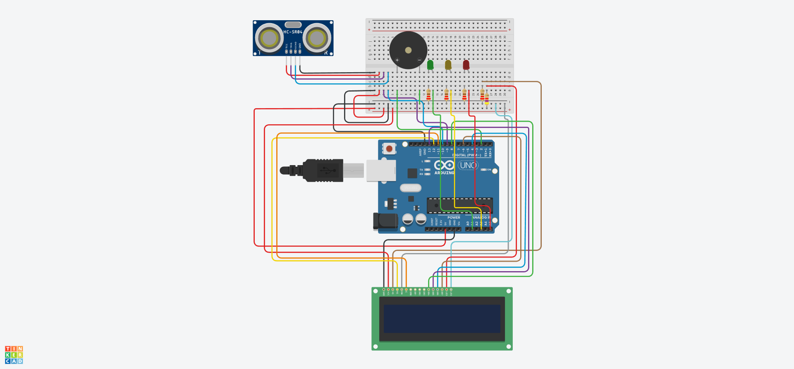
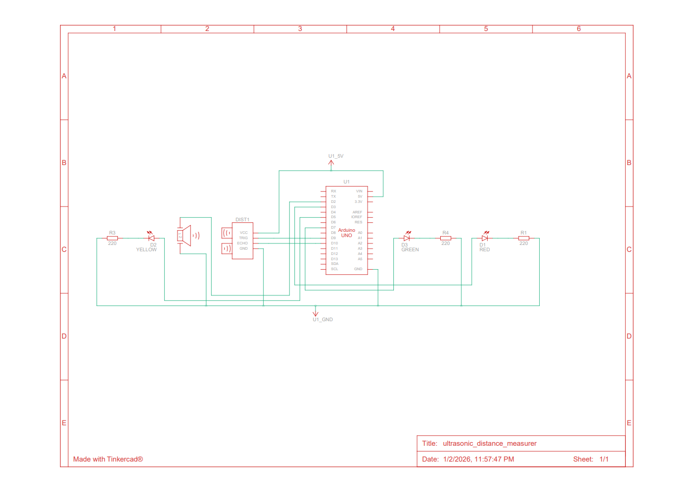

# Ultrasonic Distance Measurer

An Arduino-based embedded systems project that measures the distance to an
object using an HC-SR04 ultrasonic sensor and provides real-time visual and audible
feedback using LEDs, an active buzzer, and a 16x2 LCD.

The project demonstrates basic sensor interfacing, timing-based distance
calculation, and decision-making logic on a microcontroller.

## Overview

The system continuously measures the distance between the ultrasonic sensor
and an object placed in front of it. Based on the measured distance, one of
three LEDs lights up to indicate proximity:

- **Green** → Object is far
- **Yellow** → Object is at a medium distance
- **Red** → Object is very close

The buzzer provides audible alerts with increasing frequency as the object
moves closer to the sensor.

The LCD displays the measured distance in centimeters on the first row and the
corresponding proximity status (SAFE, MEDIUM, or CLOSE) on the second row.

Such distance-measurement systems are commonly used in applications like
parking sensors, obstacle detection, and simple robotics.

## How It Works

1. The Arduino sends a short 10 µs pulse to the **TRIG** pin of the HC-SR04.
2. The sensor emits an ultrasonic sound wave (~40 kHz).
3. The wave reflects off an object and returns to the sensor.
4. The **ECHO** pin remains HIGH for the duration of the round trip.
5. The Arduino measures this time using `pulseIn()`.
6. Distance is calculated using the speed of sound: `distance (cm) = (duration × 0.034) / 2`
7. The calculated distance is compared against predefined thresholds to determine which LED should be turned on.

## Distance Logic

| Distance Range | LED Indicator |
|---------------|---------------|
| > 20 cm       | Green         |
| 10 – 20 cm    | Yellow        |
| < 10 cm       | Red           |

These thresholds can be easily adjusted in the code.

## Circuit Diagram

The complete wiring for the project is shown below.

## Schematic Diagram

The schematic below shows the logical electrical connections between all components.

## Hardware Components

- Arduino Uno
- HC-SR04 Ultrasonic Sensor
- Active Buzzer
- Red, Yellow, and Green LEDs
- Resistors (220Ω x 4 and 4k7Ω x 1)
- Breadboard
- Jumper wires

## Pin Connections

### Ultrasonic Sensor (HC-SR04)
- **VCC** → 5V
- **GND** → GND
- **TRIG** → D9
- **ECHO** → D10

### LEDs
- **Red LED** → A5 (via resistor)
- **Yellow LED** → A3 (via resistor)
- **Green LED** → A1 (via resistor)

### Buzzer
- **Active Buzzer (+)** → D2
- **Active Buzzer (–)** → GND

### 16×2 LCD (HD44780, 4-bit mode)

- **RS** → D12  
- **E** → D11  
- **D4** → D8  
- **D5** → D13  
- **D6** → D4  
- **D7** → D6  
- **VCC** → 5V  
- **GND** → GND  
- **RW** → GND  

**Contrast (VO):**  
A fixed **4.7 kΩ resistor to GND** is used to set LCD contrast due to the absence of a potentiometer.

All cathodes are connected to ground.

## Software & Tools

- Language: C++
- Framework: Arduino
- Toolchain: PlatformIO
- Editor: Visual Studio Code
- Libraries: LiquidCrystal

## How to Run

1. Open the project in PlatformIO
2. Connect the Arduino Uno via USB
3. Upload the code to the board
4. Open the Serial Monitor (9600 baud)
5. Move an object in front of the sensor and observe the LED responses